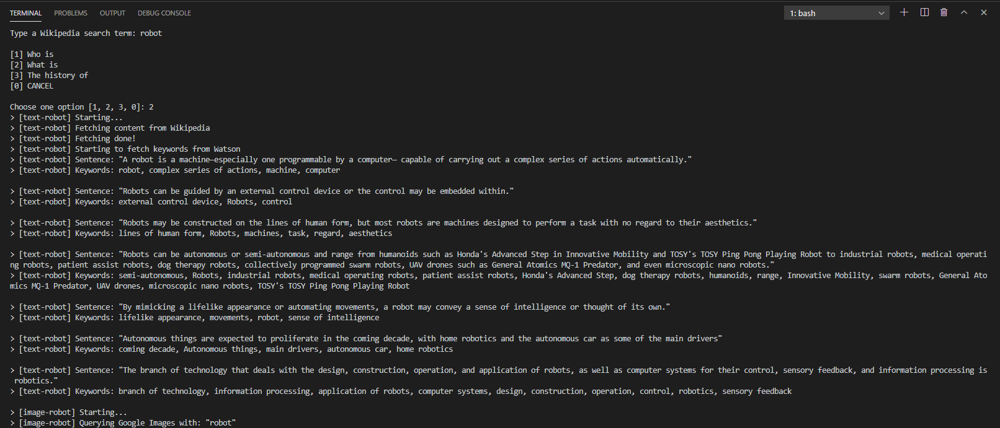
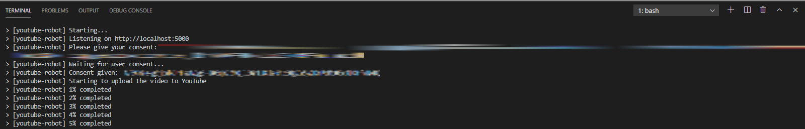
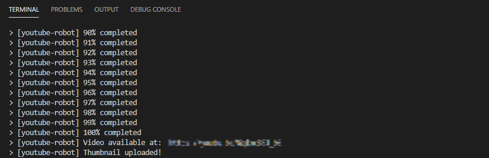

<h1 align="center">RoboTuber</h1>

<p align="center">
    <a href="#technologies">Technologies</a>&nbsp;&nbsp;&nbsp;|&nbsp;&nbsp;&nbsp;
    <a href="#project">Project</a>&nbsp;&nbsp;&nbsp;|&nbsp;&nbsp;&nbsp;
    <a href="#how-to-run">How to run</a>&nbsp;&nbsp;&nbsp;|&nbsp;&nbsp;&nbsp;
    <a href="#license">License</a>
</p>

<p align="center">
    
</a>

<br>

<p align="center">
    
</p>

## Technologies

This project was developed wth the following technologies:

- JavaScript
- [Node.js](https://nodejs.org)
- [npm](https://www.npmjs.com/)
- [FFmpeg](https://www.ffmpeg.org/)
- [FFprobe](https://ffmpeg.org/ffprobe.html)
- [Algorithmia](https://algorithmia.com)
- [Express](https://expressjs.com/)
- [ImageMagick](https://imagemagick.org/index.php)
- [Google APIs](https://googleapis.dev/nodejs/googleapis/latest/)
- [IBM Watson](https://github.com/watson-developer-cloud/node-sdk)
- [Image Downloader](https://gitlab.com/demsking/image-downloader)
- [Readline-sync](https://github.com/anseki/readline-sync)
- [Sentence Boundary Detection (SBD)](http://tessmore.github.io/sbd/)
- [Videoshow](https://github.com/h2non/videoshow)

## Project

Open source project to make automated videos with robots.
These are the robots:
- Input - Asks the term to search and the search prefix
- Text - Fetches content from Wikipedia (text only), sanitizes the content, breaks the content into sentences and fetches keywords of all sentences
- Image - Fetches images of sentences and download all
- Video - Converts all images downloaded, creates images of the sentences, creates video thumbnail and renders the video
- YouTube - Authenticates the user with OAuth, uploads the video and uploads the thumbnail

Also, there is a robot (State) that persists some contents (including the video rendered in [content](content) folder).

## How to run

Prerequisites:

Download and install [Node.js](https://nodejs.org/en/download/) and [npm](https://www.npmjs.com/get-npm).
Read the [credentials README](credentials/README.md) for further information about the credentials needed to run the project.

<br>

- Clone the repository
```bash
git clone https://github.com/erickmp07/RoboTuber.git
```

- Install the dependencies with [`npm install` command](https://docs.npmjs.com/cli/v7/commands/npm-install)
```bash
npm install
```

- In rooth path of the project, to start the robots, open the terminal and type
```bash
node index
```

NOTE 1: During the YouTube robot execution, you should give your consent to authenticate your user and the robot can upload the video to your account.

<p align="center">
    
</p>

<br>
<br>

NOTE 2: Your video will be available at the link given by the robot.

<p align="center">
    
</p>

<br>
<br>

NOTE 3: The permission given in NOTE 1 can be revoked [here](https://myaccount.google.com/notifications?origin=3).

## License

Licensed under [MIT](LICENSE) License.